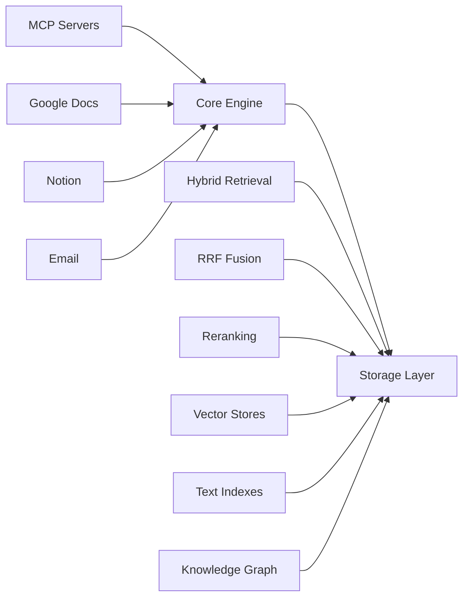

# RAG-C: MCP-First, Type-C RAG Platform

A universal, MCP-first RAG platform with pluggable components for vector stores, knowledge graphs, and data sources. Designed for production use with hybrid retrieval (RRF), cross-encoder reranking, and grounded generation.

## Key Features

- **MCP-First Architecture**: All data sources connect via Model Context Protocol (MCP) servers
- **Hybrid Retrieval**: Combines vector search + BM25 with Reciprocal Rank Fusion (RRF)
- **Cross-Encoder Reranking**: Improves precision with feature-based reranking
- **Grounded Generation**: Citations and evidence-based responses
- **Pluggable Components**: Swap vector stores, LLMs, and knowledge graphs via config
- **Production Ready**: Observability, testing, and deployment tools included

## Quick Start

```python
from RAG-C import RAGPipeline, RAGConfig, RAGQuery

config = RAGConfig(
    vector_store={"provider": "qdrant", "url": "http://localhost:6333"},
    text_index={"provider": "opensearch", "host": "localhost"},
    embedding={"provider": "google_genai", "api_key": "your-key"},
    llm={"provider": "google_genai", "model": "gemini-1.5-pro"}
)

pipeline = RAGPipeline(config)
response = await pipeline.query(RAGQuery(query="What is AI?"))
```

## Architecture



## Next Steps

- [Installation Guide](getting-started/installation.md)
- [Quick Start Tutorial](getting-started/quickstart.md)
- [API Reference](api/core.md)